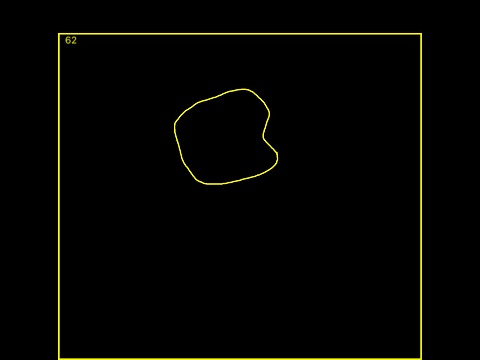
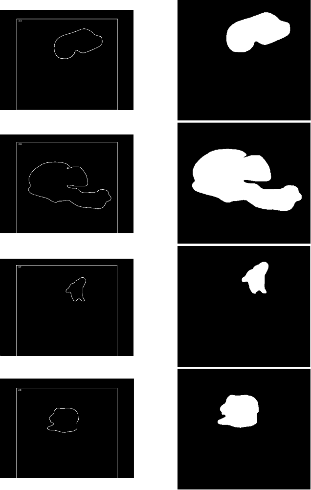
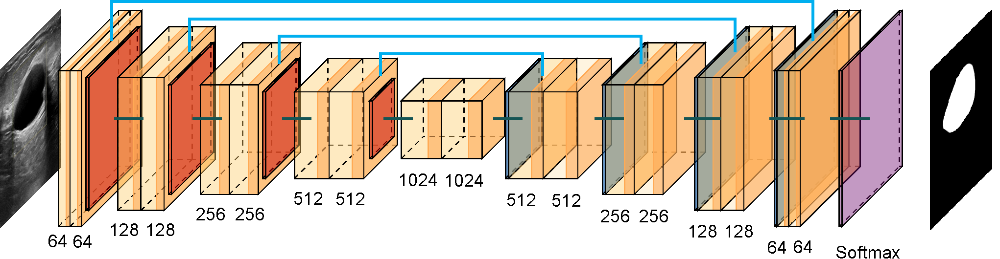
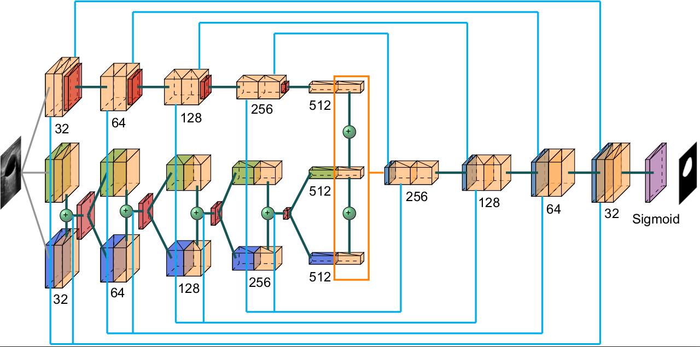

# Segmentación automática de lesiones en imágenes de ultrasonido de mama utilizando redes neuronales convolucionales: códigos

En este repositorio podrás encontrar los códigos que utilicé para realizar mi tesis de maestría, el primero es para obtener las máscaras a partir de una aplicación en Swift en la que las radiólogas pueden realizar las segmentaciones manuales para poder entenar nuestros modelos, y el segundo es la réplica de la red [Small Tumor Aware Network](https://arxiv.org/ftp/arxiv/papers/2002/2002.01034.pdf) para realizar la segmentación automática en imágenes de ultrasonido de mama.

## Máscaras
Este programa consiste en encontrar los bordes reales de la imagen marcados con amarillo: 

y copiarlos a una nueva matriz de datos. Una vez que se copia la imagen real, se rellena la lesión que esté marcada, para que posteriormente se elimine el número que se tiene como referencia en la parte superior izquierda así como el borde, para que de esta manera esté terminada la máscara:

## Small Tumor Aware Network

La arquitectura STAN está basada en la arquitectura U-Net, la cual fue desarrollada para la segmentación de imágenes biomédicas.

La arquitectura U-Net tiene dos secciones. La primera es la parte del codificador, que se utiliza para capturar las características principales de la imagen. El codificador está compuesto por una pila de capas convolucionales y de max pooling. La segunda sección es la parte del decodificador, que se utiliza para permitir una localización precisa de los objetos mediante convoluciones transpuestas. 

Cada bloque en el codificador tiene dos capas de convolución con filtros de 3 × 3 seguidas de una capa max pooling de 2 × 2. En cada nivel de la arquitectura se va duplicando el número de filtros utilizados en las capas de convolución, esto para que la arquitectura pueda aprender las estructuras complejas de forma efectiva. 

En el cuello de botella, que es la capa en la que se unen codificador y decodificador, se tienen dos capas de convolución con filtro de 3 × 3 seguida de una capa de deconvolución con un paso de 2.

Por otro lado, cada bloque en el decodificador tiene dos capas de convolución y una capa de deconvolución, y además a cada entrada de los bloques se le concatenan los mapas de características del nivel correspondiente en el codificador, estas son las llamadas conexiones de salto, ya que conectan el nivel del codificador y decodificador, esto asegura que las características aprendidas en la codificación se usen al reconstruir la imagen.

Por otro lado, la arquitectura STAN se basa en dos observaciones clave: el tamaño de los tumores varía drásticamente entre pacientes y las redes profundas existentes usan tamaños fijos de los filtros y no pueden detectar tumores de distintos tamaños, por lo que STAN implementa la construcción de mapas de características usando filtros de 3 tamaños diferentes en cada capa del codificador, con la finalidad de que se capturen características en escalas diferentes. Así, en lugar de tener un solo mapa de características, se tienen 3, por lo que se tiene más información.

Al igual que la arquitectura U-Net, la arquitectura STAN contiene una etapa de codificación y otra de decodificación, así como conexiones de salto para recuperar detalles de la imagen en el decodificador, la diferencia es que en el codificador se tienen dos ramas en lugar de una, y se comparten 2 conexiones de salto con el decodificador.

Cada bloque del codificador se define por tener en la primera rama dos capas convolucionales con un tamaño de filtro igual a 3 y una capa de maxpooling. Para la segunda rama se tienen dos capas convolucionales, la primera con filtros de 5 × 5 y de 1 × 1 seguidos de una capa convolucional con tamaño de filtro igual a 3. Esta última capa se concatena y se pasa por una capa de maxpooling. Por otro lado, se tienen 2 conexiones de salto que irán al decodificador, la primera conexión sale de la segunda capa de la primera rama y la segunda es una concatenación que sale de la primera capa de la primera rama con la concatenación de capas de la segunda rama.

Para el bloque central ya sólo existe una rama y se define por dos capas convolucionales, la primera aplica filtros de 3 × 3, 5 × 5 y 1 × 1, todos estos son seguidos de la segunda capa convolucional que solamente aplica filtros de 3 × 3 y todas estas salidas se concatenan.

Los bloques del decodificador están definidos por una capa que deconvoluciona la entrada concatenada con la primera conexión de salto del codificador en su respectivo nivel con un filtro de 3 × 3. Le sigue una capa que convoluciona filtros de 3 × 3 con la entrada de la capa concatenada a la segunda conexión de salto en su respectivo nivel del codificador y se aplica otra capa convolucional con un filtro de 3x3. Finalmente se tiene la capa de salida que es una capa convolucional con un filtro de 3 × 3 y una función de activación sigmoide.

Esta red ha superado varias arquitecturas de redes neuronales convolucionales, ya que puede detectar tumores de distinto tamaño con una tasa baja de falsos negativos, lo cual es importante para ayudar a detectar enfermedades en sus primeras etapas.

